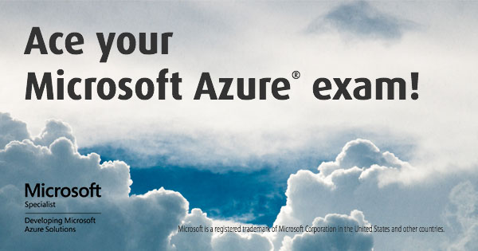

# Passing the 70-532 Developing Microsoft Azure Solutions Certification Exam
Helpful resources for passing the 70-532 Developing Microsoft Azure Solutions certification exam. Currently there are three main resource groups:

* **Powershell Scripts** - This is a collection of scripts that illustare how you can achieve specific tasks with the PowerShell cmdlets
* **Quick Facts** - Short facts about Azure that might prove useful
* **ServiceDefinition vs ServiceConfiguration Cheat Sheet** - Specifies where each Cloud Service feature is defined nad configured

## Powershell Scripts
As you probably know, passing the 70-532 Developing Microsoft Azure Solutions certification exam requires knowledge of several tools for configuring and managing Azure resources. The exam can, and probably will, include questions on Azure PowerShell, Azure CLI, Azure Portal (old and new), and REST API. I think that there is a bit of emphasis on the PowerShell side of things and nailing those questions is very important.

To lear more about the PowerShell scripts you can check out my blog post - [Passing the 70-532 Developing Microsoft Azure Solutions Certification Exam - PowerShell Scripts](http://www.newventuresoftware.com/blog/passing-the-70-532-developing-microsoft-azure-solutions-certification-exam---powershell-scripts) 

## Quick Facts
Quicks facts is a compilation of statements that explain a particular feature/behavior of a service/product offered by Azure. [Click here to see the Quick Facts file.](docs/quick-facts.md) 

## ServiceDefinition vs ServiceConfiguration Cheat Sheet
Remembering what settings go into the service definition file (.csdef) and what settings go into the service configuration file (.cscfg) is tricky. I have prepared a table (cheat sheet) that list all settings and the file where they should be specified.  
[Click here to see the ServiceDefinition vs ServiceConfiguration Cheat Sheet.](docs/definition-vs-configuration.md)

# Additional resources

[How I passed the 70-532 Developing Microsoft Azure Solutions certification exam](http://pietschsoft.com/post/2015/06/06/How-I-passed-the-70-532-Developing-Microsoft-Azure-Solutions-certification-exam)  
[Microsoft (70-532): Developing Microsoft Azure Solutions - Practice Test](http://www.measureup.com/70-532-Developing-Microsoft-Azure-Solutions-P5566.aspx)  
[Exam Ref 70-532 Developing Microsoft Azure Solutions](https://www.amazon.com/70-532-Developing-Microsoft-Azure-Solutions/dp/0735697043/)  